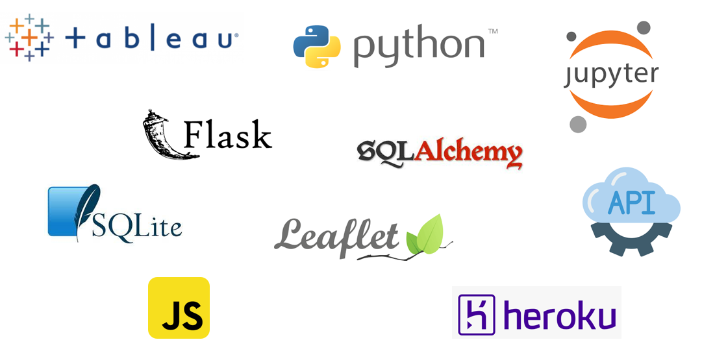

# Perth City Properties


## Table of Contents

- [Introduction](#Introduction)
- [Structure](#Structure)
- [Setup](#Setup)
- [Analysis](#Analysis)
- [Data Sources](#DataSources)
- [Technology](#Technology)
- [Contributors](#Contributors)

## Introduction

<b>Project Outline:</b>

To create a visualised data on real estate properties in the City of Perth. This includes suburbs - Crawley, East Perth, Nedlands, Northbridge, Perth, and West Perth. We also want to assist future buyers and investors to be able to predict the future property price.

<b>Questions:</b>

This project sets out to answer the following :

* What are the price range of each suburb?
* What are the property type that people are interested in buying?
* Which age range does the sold properties mostly fall under?
* Does the number of car park affect property price?
* What are the key factors that are impacting the property price?
* Are some properties better to rent or buy?
* How much is the return of investment?
* Have Covid-19 impacted the Real Estate market?


<b>ETL Process:</b>

Dataset scraped from the data source sites and filled some missing data manually to ensure data integrity. 
Cleaned the data by removing N/A and converted data types, combined all the data of the suburbs into a single data frame.
Load data onto SQLite and retrieve SQL data in Flask file to create the API.  

<b>Scope: </b>

Properties meaning residential properties which includes Unit, Apartments, Townhouses, Houses. This project will only look at landed properties - House, Townhouse & Villa.
Rent column implies that the property has been advertised and has been rented out in at the time of the Rent Date. Rent with 0 dollars value have not been advertised for Rental and will have Rent Date of 01/01/1900.


## Structure
```
 
Perth City Properties
|
|__Archive/                                 # conitains archived files since project started
|
|__ML_Model/                                # contians saved mashine learning models
|
|__ Notebooks/                              # contains ETL and ML notebooks
|     |__ Add location.ipynb                # add Geospatial data to csv files
|     |__ ETL.ipynb                         # data extract, transform, load to SQL
|     |__ ML nitebooks
|     |__ scrape.ipynb    
|
|__SQL
|
|__static/                                    
|     |__ css                               # css files for webpage
|     |__ data                              # Directory for the data files
|     |__ images                            # images used in project
|     |__ js                                #js files for webpage
|
|__Tableau                                  # tableau files
|
|__templates                                # conitan index.html
|
|__ .gitignore
|__ app.py                                  # flask file
|__ LICENSE
|__ Procfile                                # related Heroku 
|__ Project3_proposal.docx                  
|__ README.md                               # read me file
|__ requirement.txt                         # contains project dependencies
                   

```

## Setup


## Analysis

### Suburbs' Characteristics

### Suburbs' Price Ranges

### Suburbs' Propert Types

### Ages of properties

### Property car spaces

### Property buyer and seller guide

### Rent or Buy

### Property Market since Covid started


## DataSources
http://house.speakingsame.com/ 

https://www.onthehouse.com.au/

https://www.propertyvalue.com.au/


## Technology



## Contributors

- [Helen Amin](https://github.com/helenamin)
- [FangXuan Foo](https://foofx88.github.io)

